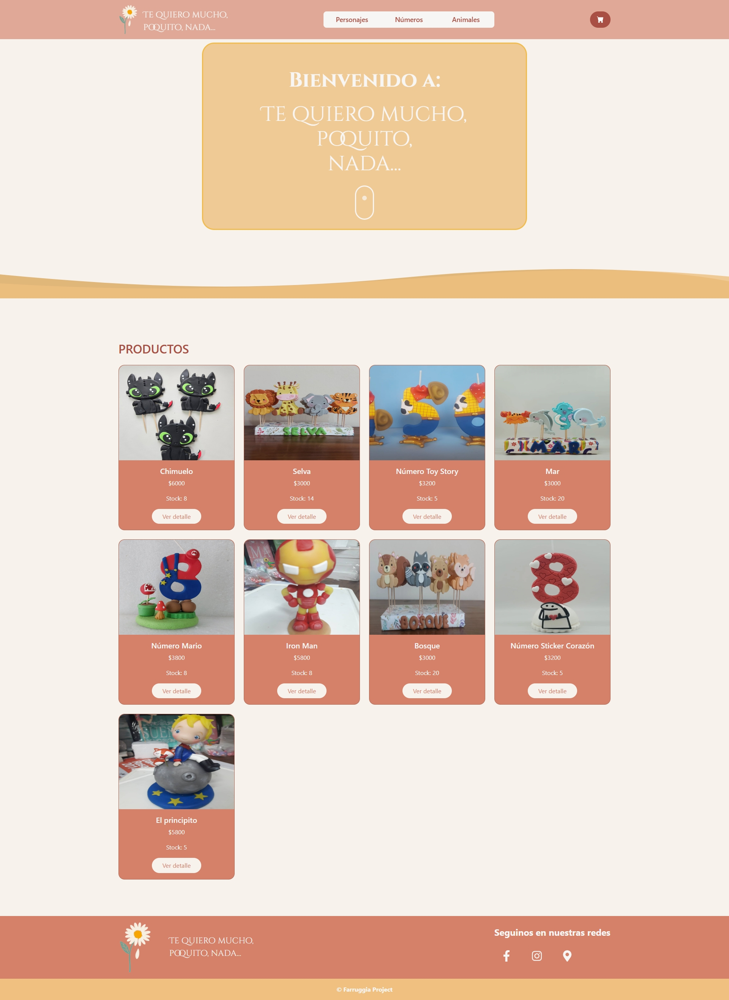
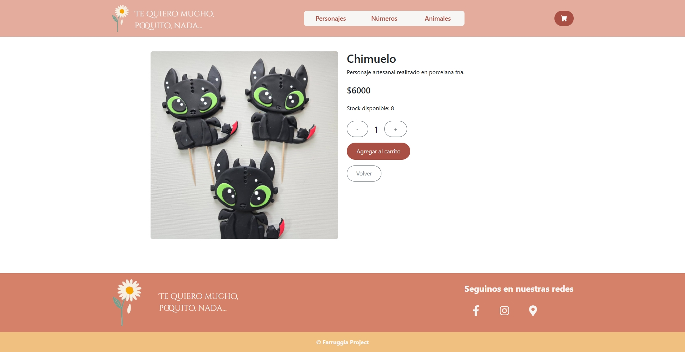
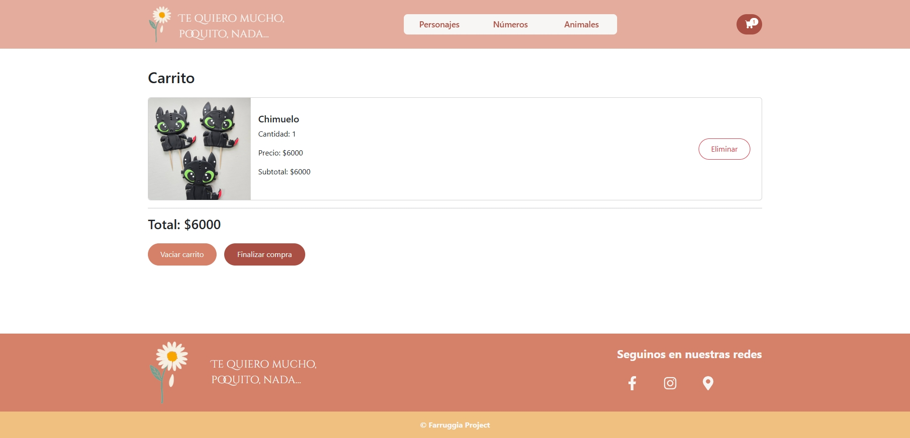
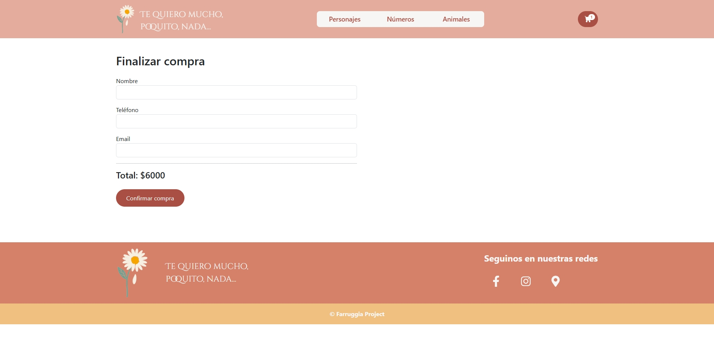
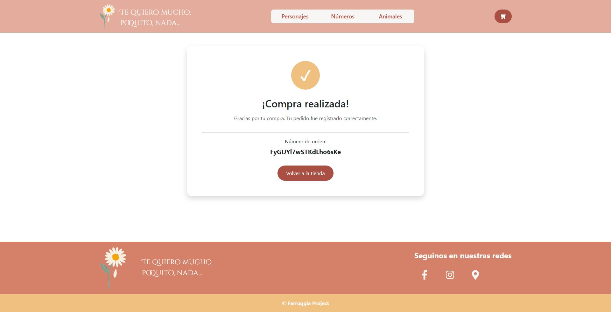

# 🌼 Te quiero mucho, poquito, nada...

**Te quiero mucho, poquito, nada...** es un e-commerce desarrollado con **React JS** para la venta de productos artesanales realizados en porcelana fría. La aplicación ofrece una experiencia de compra simple e intuitiva, permitiendo explorar productos, filtrarlos por categorías, visualizar sus detalles y completar una compra utilizando **Firebase Firestore** como base de datos.

---
## 🔗 Enlaces

- 🌐 Deploy: https://proyecto-final-farruggia.vercel.app/
- 💻 Repositorio: https://github.com/Flor-Farruggia/ProyectoFinalFarruggia

---
## ✨ Funcionalidades

- 🛍️ Listado dinámico de productos desde Firebase Firestore.
- 📂 Filtrado de productos por categorías.
- 🔍 Visualización del detalle de cada producto.
- 📦 Control de stock en tiempo real.
- 🛒 Carrito de compras con Context API.
- 🔢 Actualización automática del stock disponible según los productos agregados al carrito.
- 💾 Persistencia del carrito utilizando Local Storage.
- ❌ Eliminación individual de productos del carrito.
- 🗑️ Vaciado completo del carrito.
- 📝 Formulario de checkout con validaciones personalizadas.
- 📦 Generación de órdenes de compra en Firebase.
- 🔄 Actualización automática del stock luego de finalizar una compra.
- 🔔 Notificaciones mediante React Toastify.
- 📱 Diseño responsive para dispositivos móviles, tablets y escritorio.

---

## 🛠️ Tecnologías utilizadas

- React JS
- Vite
- React Router DOM
- Firebase Firestore
- Context API
- Bootstrap 5
- React Toastify

---

## 📦 Dependencias principales

| Dependencia | Documentación |
|-------------|---------------|
| React | https://react.dev |
| Vite | https://vite.dev |
| React Router DOM | https://reactrouter.com |
| Firebase | https://firebase.google.com/docs |
| Bootstrap | https://getbootstrap.com |
| React Toastify | https://fkhadra.github.io/react-toastify |

---

## 🚀 Instalación

### 1. Clonar el repositorio

```bash
git clone https://github.com/Flor-Farruggia/ProyectoFinalFarruggia
```

### 2. Ingresar al proyecto

```bash
cd ProyectoFinalFarruggia
```

### 3. Instalar dependencias

```bash
npm install
```

### 4. Configurar Firebase

Crear un archivo **.env** en la raíz del proyecto y agregar las siguientes variables:

```env
VITE_FIREBASE_API_KEY=
VITE_FIREBASE_AUTH_DOMAIN=
VITE_FIREBASE_PROJECT_ID=
VITE_FIREBASE_STORAGE_BUCKET=
VITE_FIREBASE_MESSAGING_SENDER_ID=
VITE_FIREBASE_APP_ID=
```

### 5. Ejecutar el proyecto

```bash
npm run dev
```

---

## 📁 Estructura del proyecto

```text
src/
│
├── assets/
│   ├── css/
│   ├── images/
│
├── components/
├── context/
├── firebase/
├── providers/
│
├── App.jsx
├── main.jsx
└── index.css
```

---

## 📸 Capturas

| Inicio | Detalle |
|--------|---------|
|  |  |

| Carrito | Checkout |
|----------|----------|
|  |  |

### Confirmación de compra



---

## 🌱 Mejoras futuras

- Sistema de búsqueda de productos.
- Filtros avanzados.
- Panel de administración para gestionar productos.
- Autenticación de administrador.
- Historial de compras.
- Integración con una pasarela de pagos.

---

## 👩‍💻 Autora

**Florencia Farruggia**

Proyecto desarrollado como entrega final del curso **React JS**.

---

## 📄 Licencia

Este proyecto fue desarrollado con fines educativos y de aprendizaje.